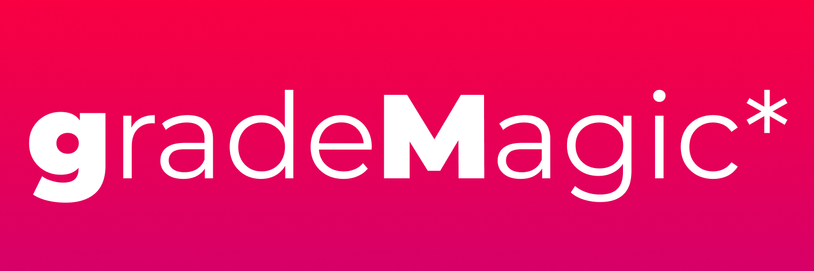

[](https://github.com/ellerbrock/open-source-badges/)
[](https://typescriptlang.org)

## Made with Lovable by love

**URL**: [lovable project link](https://lovable.dev/projects/c7c83af0-2186-4914-a696-56a06efda19e)

## Cloning the project locally

If you want to work locally using your own IDE, you can clone this repo and push changes. Pushed changes will also be reflected in Lovable.

The only requirement at the moment is having Node.js & npm installed - [install with nvm](https://github.com/nvm-sh/nvm#installing-and-updating)

Follow these steps:

### Step 1: Clone the repository using the project's Git URL.
```sh
git clone https://github.com/mohadevx/gradeMagic.git
```

### Step 2: Navigate to the project directory.
```sh
cd gradeMagic
```

### Step 3: Install the necessary dependencies.
```sh
npm i
```

### Step 4: Start the development server with auto-reloading and an instant preview.
```sh
npm run dev
```

## What technologies are used for this project?

This project is built with .

- Vite
- TypeScript
- React
- shadcn-ui
- Tailwind CSS

## Licence


